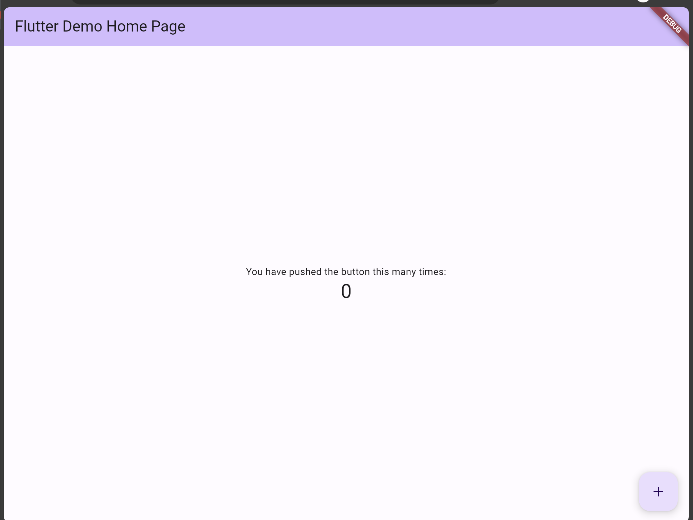

# 10일차

### SQS

- Polling 방식 메시지 전송
- Flow :
    1. 메시지 생성 > SQS 대기열에 메시지 저장
    2. 사용자가 메시지를 요청 > SQS 대기열에서 메시지 전달
    3. 사용자가 메시지 처리 후, 처리 완료 알림 전송 > SQS에서 해당 메시지 삭제

**대기열 종류**

- 표준 대기열 : 순서 상관없이 메시지를 전달, 중복 메시지가 전송 될 수도 있다.
- FIFO 대기열 : 들어온 수선대로 메시지 전달, 중복 메시지가 전송되지 않음

**Polling 종류**

Queue에 메시지가 비어 있을 때 응답을 보내는 방법의 차이 

- Short Polling : 빈 응단을 바로 보냄
- Long Polling : 설정한 시간동안 메시지가 도착할 때까지 기다리고 하나 이상의 메시지가 들어와야 응답을 보냄

**기타 설정**

- DLQ : 일정 횟수 이상 시도해도 처리되지 못한 메시지를 보관하는 큐. (설정 필요)
- Visibility Timeout : 메시지가 수신 된 일정 기간 동안 다른 소비자는 해당 메시지를 수신&처리할 수 없도록 차단하는 시간
    - Consumer의 요청에 대해 메시지가 전달되어도 SQS 남아있기 때문에 필요

### SNS

- Push 방법 메시지 전송
- Publisher - Topic - Subscriber (게시자 - 구독자)
    - Publisher가 메시지를 생성해서 Topic으로 보내면, 해당 topic을 구독하는 subscriber에게 메시지가 전송된다.
- FIFO Topic : 메시지가 topic에 게시된 순서대로 전달

**SNS +SQS**

- SNS는 특정 topic을 구독하는 모든 subscriber에게 메시지를 전송할 수 있다. // **fan out**
- SQS는 대기열에 메시지를 가지고 있을 수 있다.
- 이 둘을 조합해서 한 이벤트가 발생하면 해당 이벤트에 대해서 여러 애플리케이션이 동시에 이벤트를 처리하게 구성 할 수 있다.

---

### Flutter 개발 환경 설정

Flutter 토이 프로젝트를 위한 환경 설정을 진행했다. 

1. VS Code 설치
2. Flutter SDK 설치
    1. SDK zip 파일 다운로드 후 압축 해제 > 내부 flutter 폴더를 원하는 경로에 복사 (공백을 포함하지 않아야 한다.)
    2. 환경 변수 설정
3. Visual Studio 설치 - 웹/Windows 개발용
    1. C++ 데스크탑 개발 설치
4. Android Studio 설치 - 앱 개발용

### VS Code에서 Flutter 프로젝트 생성하기

1. Ctrl + Shift + P > Flutter : New Project 선택
    
    > Ctrl + Shift + P : command palete 단축키

2. Teminal에서 프로젝트 실행
    
    > > flutter fun 
    > > 1 [또는 2, 3 빌드하고 싶은 환경 선택]

