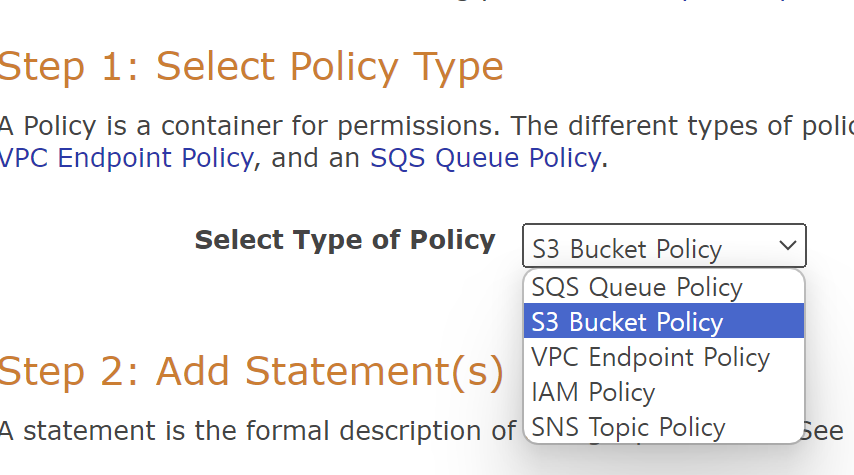
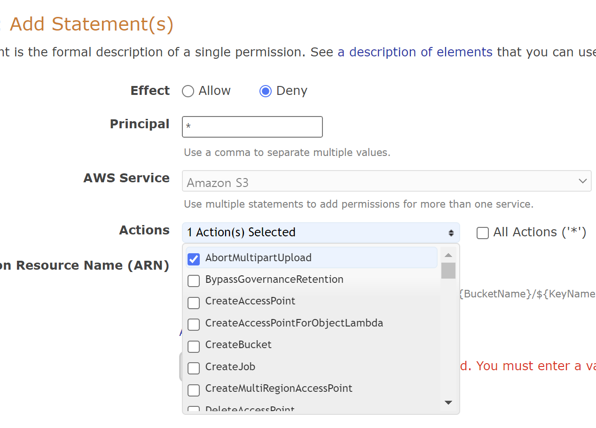
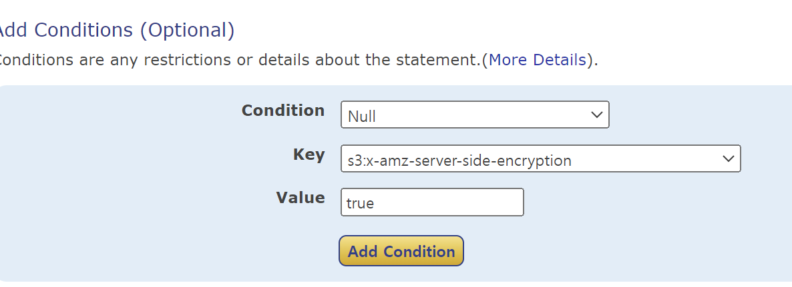
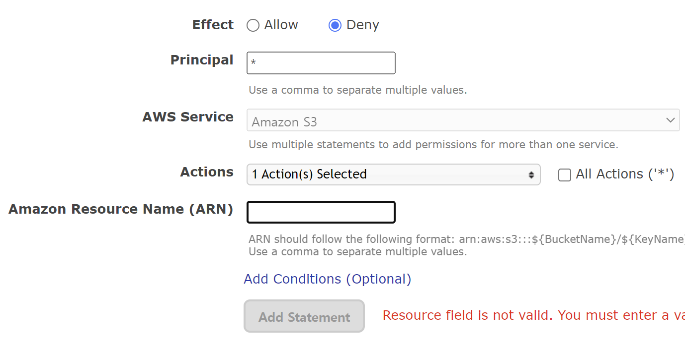

# 1일차

### 삭제 마커

- S3에서 버전 관리를 활성화한 버킷에서 객체 파일을 삭제하면, S3는 해당 객체에 대해 삭제 마커만 생성하고 실제로 객체를 영구 삭제하진 않는다.
- 삭제 마커를 삭제하면 객체 삭제를 취소할 수 있다.
- 해당 객체에 대해 영구 삭제를 수행해야 객체가 실제로 삭제된다.

### 버킷 정책 생성

AWS Policy Generator를 통해 버킷 정책을 생성할 수 있다. 

1. 정책 타입을 선택
    
    
    
2. 엑세스 Allow(허용)/Deny(거부) 설정
3. Principal 설정
    
    *Principal : 사용자, 계정, 서비스 또는 리소스에 대한 액세스를 허용/거부 권한을 부여할 대상
    
4. Actions 설정
    
    
    
5. 정책을 지정할 대상(ARN, Amazon Resource Name) 설정
    
    *현재 버킷 정책을 생성할 것이기 때문에, 버킷 ARN을 적어준다.
    
6. Add Condition으로 정책을 활성화할 조건을 설정할 수 있다.
    
    
    
    *파일을 암호화하지 않으면 true > 따라서 암호화하지 않은 파일을 버킷에 업로드하면, 업로드를 거부하겠다는 의미이다. 
    
7. Add Statement 클릭 > Generate Policy 클릭해서 나오는 Json 형식 정책을 복사해서 AWS 콘솔에 붙여 넣으면 된다. 

