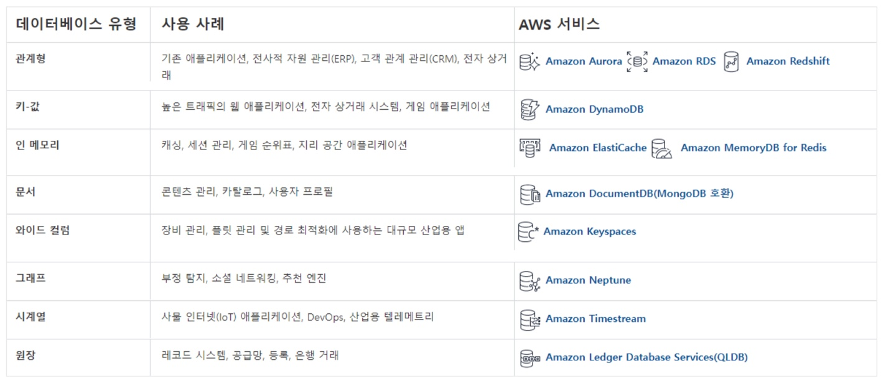

# 9일차

### 데이터베이스 정리

*관계형, 키-값(NoSQL), 인메모리 DB 유형은 특징, 기능 기억하기

### DMS

- 데이터 마이그레이션 서비스
- 같은 종류 또는 서로 다른 종류의 DB 간 마이그레이션도 가능하다.
- 다른 종류  DB 간 마이그레이션을 수행하는 경우, **Schema Conversion Tool**을 사용해 소스 DB를 대상 DB에 적합한 형태로 변환해줘야 한다.
- 소스 DB → 복제 인스턴스에 복제 → 복제본을 대상 DB로 마이그레이션
- 따라서 **복제 인스턴스**를 먼저 생성해줘야 한다.

 

1. 복제 인스턴스 생성
2. 태스크 생성
    - 복제 인스턴스
    - 소스 DB 엔드포인트
    - 대상 DB 엔드포인트

태스크를 생성하면 마이그레이션이 수행된다.