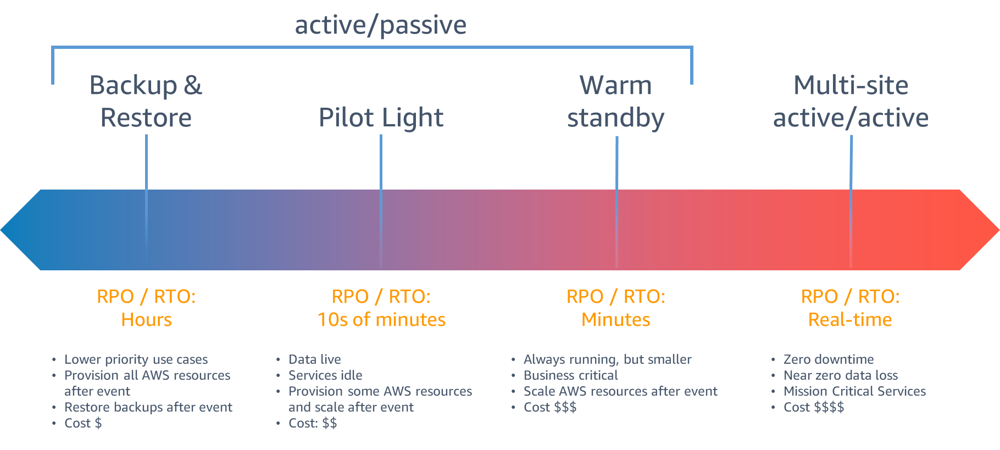

# 23일차

### 고가용**성(High availability) vs 재해 복구 (DR)**

**재해복구**

- 전체 워크로드를 별도의 장소에 복사하는 것
- 재난 이벤트 대비용
- 목표: 비즈니스의 연속성

**고가용성**

- 일부 워크로드 구성요소를 지속하는 것에 중심
- 컴포넌트 실패, 네트워크 문제, 시스템 과부하 등 구체적이고 작은 범위의 재난 대비용
- 목표: 시스템의 기능 수행 시간의 최대화

### RP**O, RTO**

**RPO**

- Recovery Point Objective, 복구 시점 목표
- 백업 이후 손실을 감당할 수 있는 데이터의 양

**RTO**

- Recovery Time Objective, 복구 시간 목표
- 비즈니스 다운타임 허용 시간 = 재해 발생 후 애플리케이션과 프로세스를 복구하는데 걸리는 목표 시간

> 데이터 백업 ← data loss → 재해 발생 ← downtime → 시스템 복구
> 

### AWS Disaster Recovery Strategies

왼→오른쪽으로 갈수록 비용 증가, 장애복구 시간 감소

- **Backup & Restore**
    - 데이터를 백업, 장애 발생 시 백업으로부터 복구
- **Pilot Light**
    - 코어 시스템만 복제 후 대기
    - 장애 발생 시 stanby site를 active site로 변경
    - 복구 시간: 수분 ~ 수십분
- **Warm stanby**
    - 전체 시스템을 원본 시스템보다 작은 용량으로 복제 후 대기
    - 장애 발생 시 사용자를 stanby site로 접속하도록 처리
    - 보다 작은 용량이기 때문에 원본에서 처리 가능한 만큼 많은 양의 트래픽을 처리하지는 못한다
    - 복구 시간: 수분
- **Mulit-site active/active**
    - 전체 시스템을 동일한 용량으로 복제하여 동시 운영
    - 가장 비쌈
    - 복구 시간: 실시간

### 복습1: AWS 시작하기

- **CUR (Cost and Usage Report)**
    - AWS 비용 및 사용에 대한 가장 상세한 보고서를 제공하는 서비스
    - 리소스, 태그 별로 비용을 분류한 보고서 생성 가능
    - 생성된 보고서 파일을 Amazon S3 버킷으로 전송 가능
- **리전, 가용영역**
    - 재해복구 설계: 2개 이상의 리전에 시스템을 배치
    - 고가용성 설계: 2개 이상의 가용영역에 시스템을 배치