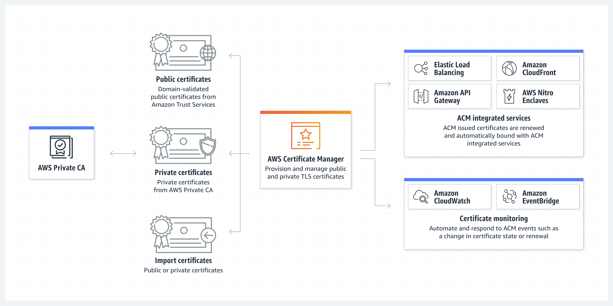
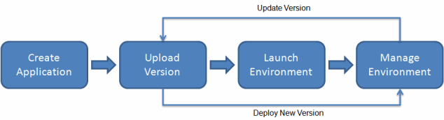
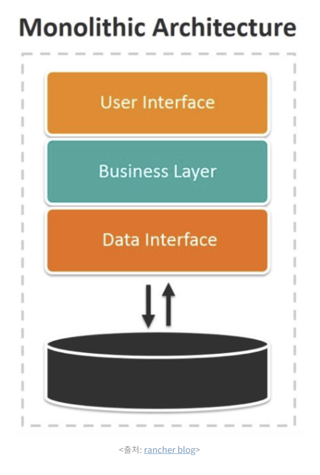

# 27일차

### ACM (AWS Certificate Manager)

- AWS 서비스나 연결된 리소스에 사용할 공인 및 사설 SSL/TLS 인증서와 키를 생성, 저장, 갱신하는 서비스
- AWS CloudTrail 로그를 통해 인증서의 사용을 감사할 수 있다.

**인증서를 통한 효과**

- 인증서를 통해 웹 사이트 트래픽을 안전하게 차단 가능
- 프라이빗 네트워크 상에서 연결된 리소스 간 통신 보호 가능
- 자동 인증서 관리 (사용자 관리 필요 없음)

→ SSL/TLS 인증서를 생성하고 Elastic Load Balancer, Amazon CloudFront 배포 및 Amazon API Gateway와 함께 배포할 수 있다. 

### AWS Elastic Beanstalk

- 애플리케이션을 AWS 클라우드에 손쉽게 배포할 수 있도록 지원하는 서비스
- 사용자가 배포 환경을 AWS에서 직접 구성할 필요가 없다.
- Go, Java, .NET, Node.js, PHP, Python 및 Ruby 지원

**사용법**

1. 애플리케이션 생성 (소스 파일)
2. Elastic Beanstalk에 소스 파일 업로드
3. Elastic Beanstalk이 자동으로 실행 환경을 세팅하고 필요한 AWS 리소스를 구성 및 배포한다.
4. 새로운 버전을 업로드하면 Elastic Beanstalk이 알아서 배포 

### cf) 모놀리식 웹 애플리케이션

- 단일 코드 베이스 애플리케이션 // 마이크로서비스의 반대
- 전체 애플리케이션이 단일 코드 베이스로, 단일 데이터베이스에 연결된다.

**장점**

- 단순성, 간편한 배포, 보편성
- 디버깅이 쉽다.
- 쉬운 테스트 및 모니터링

**단점**

- 규모가 커질수록 유지보수가 어려움
- 유연하지 않은 확장성 → 전체 애플리케이션의 확장만 가능 (특정 부분만 확장 불가능)
- 대규모 팀 작업이 어렵다 → 동일한 프로젝트에서 여러 명이 작업할 경우 코드 병합에 대한 충돌 가능성이 높음, 기술 변경 시 다른 팀 작업에 영향을 줄 수 있음