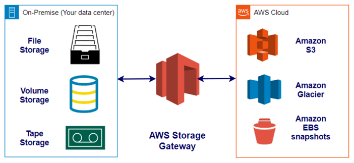
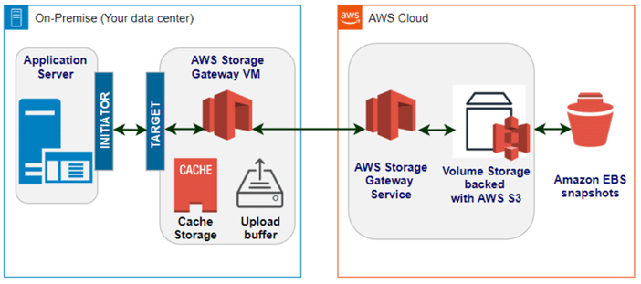

# 29일차

### cf) 오프사이트 백업 (off-site backup)

- 원격 서버나 off-site로 데이터를 백업하는 방법
    - 실제 프로덕트 사이트와 지리적으로 다른 위치에 데이터를 백업
- 일반적인 방법: 클라우드 백업, 테이프 백업
- 클라우드 백업
    - 데이터의 복사본을 네트워크를 통해 오프사이트 서버로 전송해서 백업

### Amazon Storage Gateway

**[참고](https://blog.bespinglobal.com/post/aws-storage-gateway-%EC%9D%B4%ED%95%B4%ED%95%98%EA%B8%B0/)**

- 온프레미스 애플리케이션을 클라우드 기반 스토리지와 연결하여 온프레미스와 AWS의 스토리지를 사용하는 서비스

**사용 사례**

- 클라우드 스토리지에서 온프레미스에 데이터를 백업
- 온프레미스 애플리케이션에서 AWS에 저장된 데이터에 대해 짧은 지연 시간으로 액세스

### +) AWS Storage Gateway의 캐싱 볼륨

- S3를 데이터 스토리지로 사용하며 자주 액세스하는 데이터를 storage gateway에 로컬 캐싱 할 수 있다.

