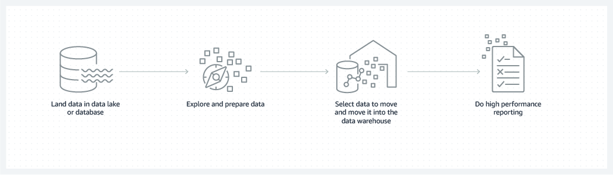

# 30일차

### cf) 데이터 웨어하우스

[참고: 데이터웨어히우스란 무엇입니까?](https://aws.amazon.com/ko/what-is/data-warehouse/)

> 데이터 웨어하우스는 **정보에 입각한 의사 결정을 내릴 수 있도록 여러 소스에서 가져온 분석 가능한 정보의 중앙 리포지토리입니다.**
데이터 웨어하우스는 데이터를 효율적으로 저장하여 보고서, 대시보드 및 분석 도구를 강화함으로써 데이터의 입출력(I/O)을 최소화하고 수백 수천 명의 사용자에게 동시에 신속하게 쿼리 결과를 제공합니다.
> 
- 자주 액세스 되는 데이터는 빠른 스토리지 (SSD드라이브), 자주 액세스 하지 않는 데이터는 저렴한 스토리지 (Amazon S3)에 저장한다.
- 데이터는 데이터베이스에 [테이블 형태](https://aws.amazon.com/ko/what-is/data-warehouse/)로 구성된다.
    - 반면 데이터 레이크는 정형, 반정형, 비정형 데이터를 비롯한 모든 데이터에 대한 중앙 리포지토리이다.
- Amazon Redshift : 완전 관리형 데이터 웨어하우스 서비스

 

**설계 구조**

티어로 구성된다. 

- 상단 티어: 보고, 분석 및 데이터 마이닝 도구를 통해 결과를 제시하는 프론트엔드 클라이언트 // 결과
- 중간 티어: 데이터를 액세스하고 분석하는데 사용되는 분석 엔진 // 분석
- 하단 티어: 데이터가 로드되고 저장되는 데이터베이스 서버 // 저장

**장점**

- 정보에 기반한 의사 결정
- 여러 소스의 데이터 통합
- 과거 데이터 분석
- 데이터 품질, 일관성 및 정확성
- 트랜잭션 데이터베이스와 분석 처리를 분리하여 두 시스템 모두의 성능을 향상

→ **데이터 베이스, 데이터 레이크, 데이터 웨어하우스**를 조합해서 데이터를 저장 및 분석한다.