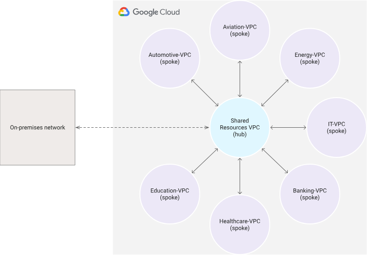
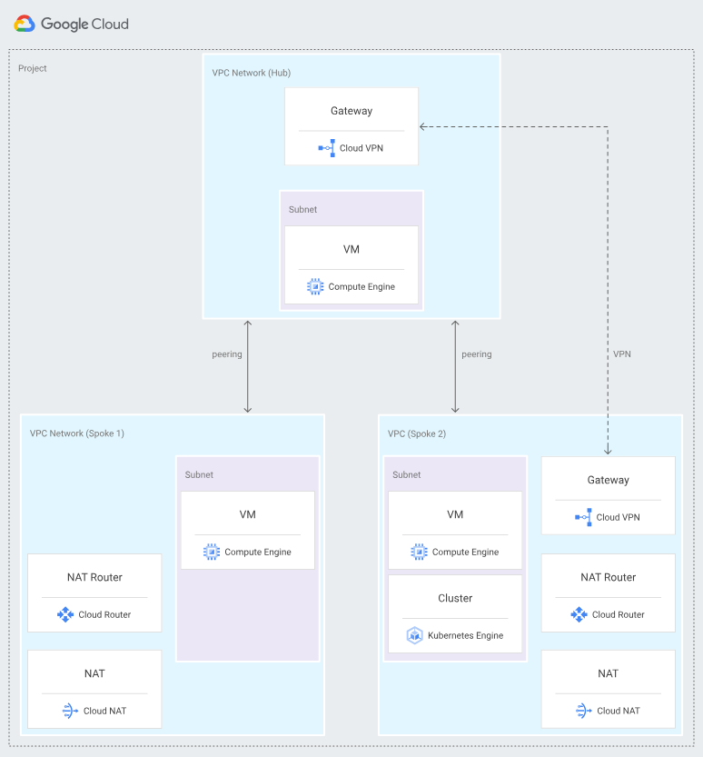

# 32일차

### Transit Gateway

- VPC와 온프레미스 네트워크를 상호 연결하는 완전 관리형 네트워크 전송 허브
    - 별도로 가상 어플라이언스를 프로비저닝 할 필요가 없다.
- 리전 리소스
- 연결 가능한 리소스:
    - 동일 리전 내 하나 이상의 VPC
    - 서드 파티 네트워크 어플라이언스
    - AWS Direct Connect 게이트웨이
    - 다른 Transit Gateway와 피어링 연결
    - 다른 Transit Gateway에  대한 VPN 연결
- 고가용성, 완전 관리형

### VPC 피어링 vs Transit Gateway

- VPC 피어링은 최대 대역폭이 없다. Transit Gateway는 최대 대역폭 제한이 있다.
- VPC 피어링은 데이터 전송 요금만 지불, Transit Gateway는 데이터 전송 요금 + 연결 시간 당 요금 부과
- VPC 피어링은 보안그룹 설정 가능
- Transit Gateway는 여러 VPC 피어링 연결을 만들고 관리하기 어려울 때 사용하기 적절하다.

 

**cf) 어플라이언스**

> Appliance : 용도에 특화된 기기나 장치
> 

> Appliance Server : 특정 용도 전용으로 설계, 개발 된 서버
ex) 프록시 서버, 파일 서버
> 

### VPC 연결 방법

[참고: VPC 간 연결](https://docs.aws.amazon.com/ko_kr/whitepapers/latest/building-scalable-secure-multi-vpc-network-infrastructure/vpc-to-vpc-connectivity.html)

- VPC 피어링
    - 두 VPC를 연결하는 방식
    - 각 VPC에 온프레미스 연결(VPN, Direct Connect)을 설정해야 한다.
    - VPC 수가 10개 미만, 각 VPC 연결을 개별적으로 관리해야 할 때 적절하다.
    - 가장 비용이 낮다
- Transit Gateway
    - VPC 나 온프레미스 네트워크를 완전 관리형 서비스로 연결하는 서비스
    - 허브 앤 스포크 설계
    - 수천개 VPC 연결 가능
- 그 외

### cf) 허브 앤 스포크 네트워크

- 허브 앤 스포크 네트워크
    - 중심에 공유 허브 VPC 존재
    - 각 스포크 VPC는 허브 VPC와 각각 연결되어 있다.

- VPC 네트워크 피어링을 사용한 허브 앤 스포크 네트워크
    - VPC 피어링을 통해 서로다른 VPC 네트워크에 존재하는 리소스가 내부 IP 주소로 통신한도록 지원한다.

