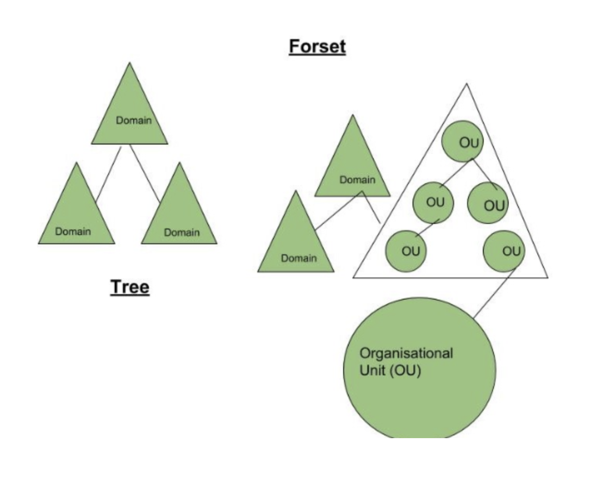

# 36일차

### cf) 데이터 전송 속도 계산

1. 단위 통일
    - 8 bits (b) = 1 byte (B)
    - 1024 bytes = 1 Kilobyte (KB)
    - 1024 Kilobytes = 1 Megabyte (MB)
    - 1024 Megabytes = 1 Gigabyte (GB)
    - 1024 Gigabytes = 1 Terabyte (TB)
2. (데이터양) / (전송 속도)

> K = 10^3 (2^10)
M = 10^6 (2^20)
G = 10^9 (2^30)
T = 10^12 (2^40)
> 

> bps : 1 sec에 몇 bit 전송할 수 있는지
> 

예시) 100Mbps 속도로 150 TB 데이터를 전송할 때 소요 시간

150 * (1024)^2 * 8 / 100  

### cf) Active Directory

- 조직의 규모가 커질수록 객체의 개수가 많아져 관리가 어려워진다. 사용자는 공유 자원의 위치와 해당 서버의 로컬 사용 계정 정보를 모두 알아야 정상적인 접근이 가능하다. → 관리의 어려움
- 중앙 서버에 공통된 데이터베이스를 생성하여 각 서버와 클라이언트는 해당 데이터베이스를 공유하여 객체를 검색하고 사용할 수 있도록 하는 서비스를 **Directory Service** 라고 한다.
    - 네트워크 환경에서 자원 공유 가능
    - 중앙 서버에서 통합 관리 가능
- **AD (Active Directory)**: 마이크로소프트 환경에서 제공하는 Directory Service

**구성**

- 도메인 (Domain) : 가장 기본 단위. 사용자, 컴퓨터, 기타 AD 객체로 구성되는 그룹
- 트리 (Tree) : 여러 개의 도메인의 집합
- 포리스트 (Forests) : 여러 개의 트리의 집합

> 도메인은 관리 경계로, 특정 도메인의 객체들은 하나의 데이터베이스에 저장되어 함께 관리할 수 있다.
> 

> 포리스트는 보안 경계로, 서로 다른 포리스트의 객체는 각 포리스트의 관리자가 해당 객체 간 신뢰를 형성하지 않는 한 상호작용할 수 없다.
> 

- 도메인 컨트롤러 (DC) : 로그인, 이용 권한 확인, 암호 변경 등을 처리하는 서버 컴퓨터
    - AD에서 도메인 서비스를 구현할 경우 한 도메인에 하나 이상의 DC를 구성해야 한다.

[참고: Active Directory](https://learn.microsoft.com/ko-kr/previous-versions/windows/it-pro/windows-server-2003/cc759186(v=ws.10))