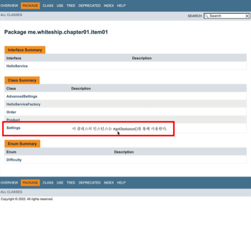

### 단점 1. 상속을 하려면 public이나 protected 생성하기 필요하니 정적 팩토리 메서드만 제공하면 하위 클래스를 만들 수 없다.

앞에서 살펴봤듯 '정적 팩토리 메서드로만 객체 생성을 할 수 있게 설계'를 한다면 생성자를 private으로 만들어야 한다.
그로 인해 상속이 안 된다는 단점이 생기게 된다.

```java
// 일반적인 생성자가 아니라 정적 팩토리 메서드로만 인스턴스를 만들 수 있는 Settings 클래스

public class Settings{
    private static final Settings SETTINGS = new Settings();
    
    private Settings(){}
    
    public Settings getInstance(){
        return SETTINGS;
    }
}

```

```java
public class AdvancedSettings extends Settings { // <- 컴파일 에러 발생
    // public이나 protected 생성자가 없으므로 상속이 불가능하다.
}
```


### 단점 2. 정적 팩토리 메서드는 프로그래머가 찾기 어렵다.
생성자는 직관적인 반면, 정적 팩토리 메서드의 경우 한 클래스 내에 메서드 수가 많을 땐 찾기 어렵다는 단점이 있다.

#### 보완 방법
1. 명명법 사용
```java
// pp.12~13 정적 팩토리 메서드에 흔히 사용되는 명명 방식들

// from : 매개변수를 하나 받아서 해당 타입의 인스턴스를 반환하는 형변환 메서드
Date d = Date.from(instant);

// of : 여러 매개변수를 받아 적합한 타입의 인스턴스를 반환하는 집계 메서드
Set<Rank> faceCards = EnumSet.of(Rank.JACK, Rank.QUEEN, Rank.KING);

// valueOf : from과 of의 더 자세한 버전
BigInteger prime = BigInteger.valueOf(1000L);

// instance 혹은 getInstance : (매개변수를 받는다면) 매개변수로 명시한 인스턴스를 반환하지만, 같은 인스턴스임을 보장하지는 않는다.
StackWalker luke = StackWalker.getInstance();

// create 혹은 newInstance : instance 혹은 getInstance와 같지만, 매번 새로운 인스턴스를 생성해 반환함을 보장한다.
Object newArray = Array.newInstance(classObject, arrayLen);

// getType : getInstance와 같으나, 생성할 클래스가 아닌 다른 클래스에 팩토리 메서드를 정의할 때 쓴다. "Type"은 팩토리 메서드가 반환할 객체의 타입이다.
FileStore fs = Files.getFileStore();

// newType : newInstance와 같으나, 생성할 클래스가 아닌 다른 클래스에 팩토리 메서드를 정의할 때 쓴다. "Type"은 팩토리 메서드가 반환할 객체의 타입이다.
BufferedReader br = Files.newBufferedReader();

// type : getType과 newType의 간결한 버전
List<String> strList = Collections.list();
```

2. Javadoc 이용 (문서화)
```java
/**
 * 이 클래스의 인스턴스는 #getInstance()를 통해 사용한다.
 * @see #getInstance()
 */
public class Settings {
    private Settings(){}

    private static final Settings SETTINGS = new Settings();
    
    public static Settings getInstance(){
        return SETTINGS;
    }
}
```
