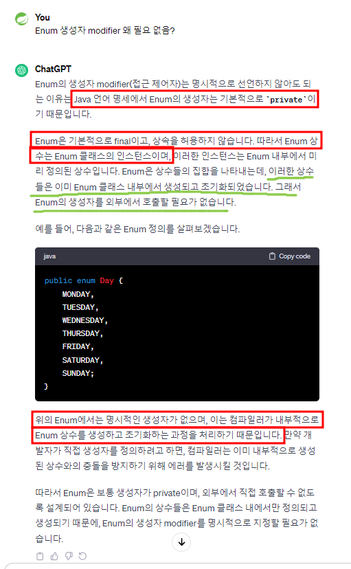

### Enum (이늄) 

cf. Java 5 버전부터 지원하기 시작

상수 목록을 담을 수 있는 데이터 타입

특정한 변수가 가질 수 있는 값을 제한할 수 있다. 타입-세이프티(Type-Safety)를 보장할 수 있다.

싱글톤 패턴을 구현할 때 사용하기도 한다.

질문1) 특정 enum 타입이 가질 수 있는 모든 값을 순회하며 출력하라.

질문2) enum은 자바의 클래스처럼 생성자, 메서드, 필드를 가질 수 있는가?

질문3) enum의 값은 == 연산자로 동일성을 비교할 수 있는가?

과제) ~~enum을 key로 사용하는 Map을 정의하세요. 또는 enum을 담고 있는 Set을 만들어 보세요.~~ 왜 Enum을 key로 사용할 때? EnumMap과 EnumSet을 사용하면 좋은지 설명하라. 일반적인 Map, Set말고

