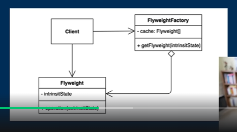

같은 객체가 자주, 여러 번 사용될 상황이라면 여러분은 어떻게 할 것인가??  
당연히 어딘가에 저장해놨다가 재사용하면 좋지 않을까? 라는 생각을 했을 것이다. 
혹은 업무적으로 경험이 있으신 분들은 **캐싱(caching)**을 하면 좋겠다라는 생각을 했을 겁니다. 
이렇듯 **플라이웨이트 패턴은 객체를 재사용하는 방법 중에 하나**이다.

**플라이웨이트 패턴**
- Flyweight (가벼운 체급) 
- 객체를 가볍게 만들어 메모리 사용을 줄이는 패턴
- 자주 변하는 속성(또는 외적인 속성, extrinsit)과 변하지 않는 속성(또는 내적인 속성, intrinsit)을 분리하고 재사용하여 메모리 사용을 줄일 수 있다.

상세 설명 
1. 자주 변하는 속성과 변하지 않는 속성을 분리
2. 자주 변하지 않는 속성들은 **FlyweightFactory**라는 곳에 따로 모아놓음.
3. 그래서 필요할 때마다 그 Factory에서 꺼내다가 쓰는 **디자인 패턴**

★Character라는 예제 코드 참조!